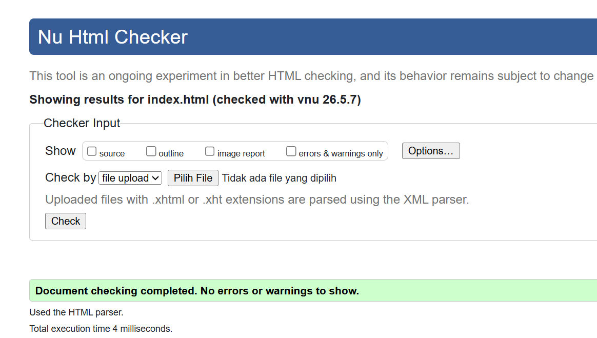
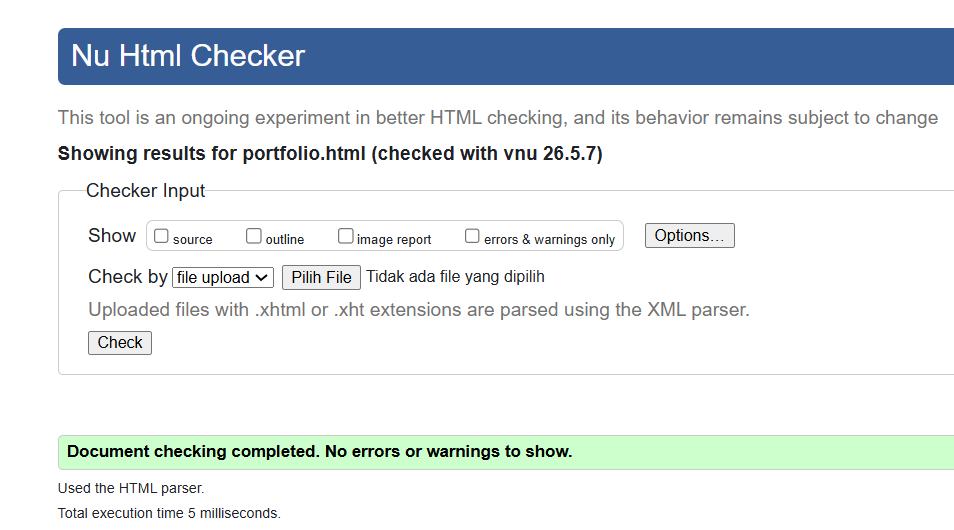
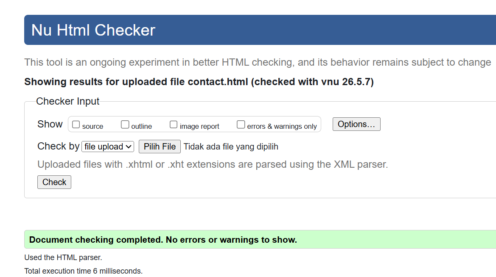
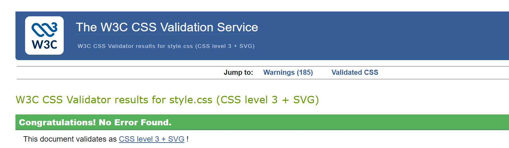
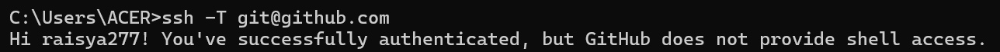

# REPORT.md — Tugas 1: Personal Website "Blossom"

---

## 1. Deskripsi Proyek

**Blossom** adalah website profil personal milik **Raisya Salma**, mahasiswa Teknik Informatika di Universitas Muhammadiyah Surakarta. Website ini dibuat sebagai tugas pertama mata kuliah pemrograman web dengan tujuan menampilkan identitas diri, portofolio proyek, dan formulir kontak.

### Tujuan
Menampilkan profil diri secara digital dengan desain yang estetis, responsif, dan aksesibel — sekaligus menjadi media untuk menunjukkan kemampuan di bidang desain dan pengembangan web.

### Fitur Utama
- Desain bertema pink/blush yang konsisten di seluruh halaman
- Navigasi sidebar vertikal (desktop) & top bar (mobile)
- Dark mode toggle dengan penyimpanan preferensi via `localStorage`
- Custom cursor animasi (titik + ring)
- Ticker strip animasi skill yang berjalan otomatis
- Hero section dengan diagonal split layout
- Grid proyek dengan hover effects
- Formulir kontak (tampilan saja)
- Fully responsive untuk mobile dan desktop

### Teknologi yang Digunakan
| Teknologi | Penggunaan |
|-----------|------------|
| HTML5 (Semantic) | Struktur halaman (`header`, `nav`, `main`, `footer`, `article`, `section`) |
| CSS3 External | Seluruh styling di `style.css` |
| CSS Flexbox & Grid | Layout navigasi, hero, grid kartu proyek, footer |
| CSS Custom Properties | Sistem warna, font, dan spacing yang konsisten |
| CSS Animations & Keyframes | Animasi `fadeSlideUp`, ticker, hover effects |
| CSS Media Queries | Responsivitas di breakpoint 1024px dan 640px |
| Google Fonts | Unbounded, Instrument Serif, Syne |
| JavaScript (Vanilla) | Custom cursor, dark mode toggle |

---

## 2. Struktur Folder & File

```
blossom-personal-website/
│
├── index.html          # Halaman Beranda
├── portfolio.html      # Halaman Portofolio
├── contact.html        # Halaman Kontak
├── style.css           # File CSS eksternal (satu file untuk semua halaman)
├── LAPORAN.md           # Laporan proyek ini
│
└── images/
    ├── profile.png         # Foto profil
    ├── webdev.png          # Thumbnail proyek Web Dev
    ├── game.png            # Thumbnail proyek Game Dev
    └── linux.png           # Thumbnail proyek Linux
```

---

## 3. Penjelasan Setiap Halaman

### `index.html` — Beranda (Page 01)
- **Hero Section**: Layout diagonal split, foto profil, judul nama, deskripsi singkat, dan dua tombol CTA (*Lihat Portofolio* & *Hubungi Saya*)
- **Skills Ticker**: Animasi teks berjalan yang menampilkan skill (HTML, CSS, JavaScript, UI/UX, dll.)
- **About Strip**: Paragraf tentang diri, menggunakan CSS Grid dua kolom
- **Stats Row**: Menampilkan angka pencapaian (5+ proyek, 1,5 tahun, ∞ semangat)
- **Featured Work**: Preview 3 kartu proyek unggulan yang terhubung ke `portfolio.html`

### `portfolio.html` — Portofolio (Page 02)
- **Portfolio Hero**: Heading besar dengan eyebrow label
- **Filter Bar**: Tombol filter (Semua / UI Design / Web Dev / Lainnya) — interaktif secara visual
- **Project Grid**: 5 kartu proyek lengkap dengan tahun, nama, deskripsi, dan tag teknologi
  - Web Kasir (PHP, MySQL)
  - Web Profil (HTML, CSS)
  - Remastering Linux
  - Game di Alice
  - Game di Greenfoot (Java)
- **CTA Section**: Ajakan kolaborasi dengan link ke halaman kontak

### `contact.html` — Kontak (Page 03)
- **Layout Dua Kolom**: Informasi kontak di kiri, formulir di kanan
- **Info Kontak**: Email, lokasi, kampus, status ketersediaan
- **Social Links**: GitHub, LinkedIn, Instagram
- **Formulir Kontak**: Nama, email, subjek, topik (dropdown), pesan, tombol kirim
- *Catatan: Formulir hanya untuk tampilan, tidak terhubung ke backend*

---

## 4. Fitur CSS yang Digunakan

### CSS Custom Properties (Variables)
Semua warna, font, dan nilai layout didefinisikan sebagai variabel di `:root` sehingga konsisten dan mudah diubah:
```css
--pink-deep: #db2777;
--ff-display: 'Unbounded', sans-serif;
--sidebar-w: 72px;
```

### Flexbox & Grid
- Navigasi sidebar: `flex-direction: column`
- Hero section: `display: flex; align-items: stretch`
- Project grid: `display: grid; grid-template-columns: repeat(3, 1fr)`
- Contact layout: `display: grid; grid-template-columns: 1fr 1.4fr`

### Animasi
- `@keyframes fadeSlideUp`: Elemen masuk dari bawah ke atas saat halaman dimuat
- `@keyframes ticker`: Ticker berjalan dari kanan ke kiri secara infinite
- Hover effects pada kartu: transform scale, wipe fill pada tombol, garis vertikal pada project card

### Responsivitas
```css
@media (max-width: 1024px) { /* Tablet & mobile: nav jadi top bar */ }
@media (max-width: 640px)  { /* Mobile kecil: font lebih kecil, cursor disembunyikan */ }
```

### Dark Mode
Diimplementasikan dengan `data-theme="dark"` pada elemen `<html>`, overriding semua CSS variables warna. Preferensi disimpan di `localStorage`.
- Dark mode toggle.
- Skor **Lighthouse ≥ 80** pada kategori **Performance** dan **Accessibility** (
).
---

## 5. Aksesibilitas (a11y)

| Aspek | Implementasi |
|-------|-------------|
| Semantic HTML | `<header>`, `<nav>`, `<main>`, `<footer>`, `<article>`, `<section>` digunakan sesuai fungsinya |
| `alt` pada gambar | Semua `` memiliki atribut `alt` yang deskriptif |
| `aria-label` | Digunakan pada navigasi, tombol, form, dan elemen dekoratif |
| `aria-current="page"` | Diterapkan pada link navigasi halaman yang aktif |
| `aria-hidden="true"` | Elemen dekoratif (cursor, lingkaran) disembunyikan dari screen reader |
| `aria-pressed` | Digunakan pada tombol filter di halaman portofolio |
| Keyboard Navigation | Semua link dan tombol dapat diakses via Tab |
| Kontras Warna | Warna teks `--charcoal` (#1a0a12) di atas `--cream` (#fffaf7) memenuhi rasio kontras 4.5:1 |

---

## 6. Validasi Kode

### HTML Validator
Validasi dilakukan di https://validator.w3.org/ untuk ketiga halaman:

| Halaman | Hasil |
|---------|-------|
| `index.html` | ✅ 
| `portfolio.html` | ✅ 
| `contact.html` | ✅ 

### CSS Validator
Validasi dilakukan di https://jigsaw.w3.org/css-validator/ untuk `main.css`:

| File | Hasil |
|------|-------|
| `main.css` | ✅ 

---

## 7. Deployment

| Platform | Status |
|----------|--------|
| Netlify | *[ https://raisyawebprofile.netlify.app/* |

Buka netlify.com → Login
1. Klik "Add new site" → "Import an existing project"
2. Pilih GitHub
3. Cari dan pilih repository membangun-website-personal-raisya277
4. Pilih branch: main (setelah merge tadi)
5. Klik "Deploy site"
6. Tunggu sebentar , website akan aktif di `https://raisyawebprofile.netlify.app/`

---

## 8. Screenshot Konfigurasi SSH

> *[  ]*

output setelah SSH dikonfigurasi:
```
Hi raisya277! You've successfully authenticated, but GitHub does not provide shell access.
```

---

## 9. Catatan Pengembangan

- **Typo minor** ditemukan di `index.html` pada eyebrow label: `"Cretaive Thinker"` → seharusnya `"Creative Thinker"`
- Formulir kontak sengaja tidak dihubungkan ke backend sesuai spesifikasi tugas (design only); terdapat catatan di halaman: *"Formulir ini hanya untuk tampilan. Hubungi via email untuk pesan asli."*
- Semua `style` diletakkan di file eksternal `style.css`, tidak ada inline styles

---

## 10. Referensi

- [MDN Web Docs — HTML](https://developer.mozilla.org/en-US/docs/Web/HTML)
- [MDN Web Docs — CSS](https://developer.mozilla.org/en-US/docs/Web/CSS)
- [Google Fonts — Unbounded, Instrument Serif, Syne](https://fonts.google.com/)
- [WebAIM Contrast Checker](https://webaim.org/resources/contrastchecker/)
- [W3C HTML Validator](https://validator.w3.org/)
- [W3C CSS Validator](https://jigsaw.w3.org/css-validator/)

---

*© 2026 Raisya Salma — Universitas Muhammadiyah Surakarta*
